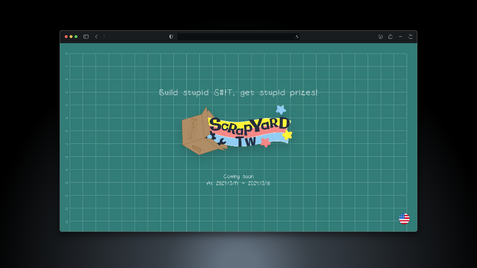

# Scrapyard Taiwan Event Website


Hello there! This repository is the source code for the Scrapyard Taiwan event website. The website is built using [Astro](https://astro.build/), a ultra fast framework. The website is hosted on [GitHub Pages](https://pages.github.com/).

## Development

> We use corepack to ensure that you have the same `pnpm` that we uses. You can install pnpm by running:
>
> ```bash
> corepack install
> ```

To start developing, clone the repository and run the following commands:

```bash
pnpm install
```

And run the development server:

```bash
pnpm dev
```

The site should be available at `http://localhost:4321`.

## Contributing

If you would like to contribute to the website, please fork the repository and submit a pull request. We welcome all contributions!
